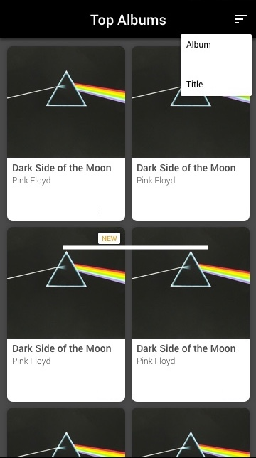

# Upwards Challenge

## Prompt

A client has an idea for an application but all that's been provided is the following description and mockup:

```
I want an app where you can see the best music albums from iTunes. It 
should have a modern design. They should also be able to sort the albums.
I tried to make the app myself but I am too busy. Recently released albums 
should also be noted. Thanks.

For reference here is the api we are using: https://rss.itunes.apple.com/en-us
```


Your task is to checkout the provided code and provide a submission that accomplishes the features the client is requesting. Beyond the functional requirements, we will also be considering the following areas (among others) of code quality:

- Architectures & Frameworks
- SOLID Principles
- File Structure
- Naming Conventions
- Bugfixes & Improvements
- Testing


## Running Project

Steps to running the Upwards Challenge Project

1. Navigate to github repository and clone the repository: https://github.com/helgeryan/upwards-challenge (or Download a zip file)
2. Open the project file: 'upwards-ios-challenge.xcodeproj'
3. Wait for Packages (only Lottie currently) to sync via SwiftPackageManager. 
NOTE: If the Packages fail for any reason navigate in XCode to File > Packages > Resolve Package Versions
4. Select simulator/device
5. Build/Run

## Coding Assumptions

- The two sort methods given were Album and Title, instead of sorting both with the album title I sorted the Album with the Albums ID. To demonstrate another sort that was visible to test with I added a sort by artist name.
- Colors were not given for the UI, I stuck with the general UIColors provided by Swift
- Removed run destinations for iMac and iPad as they were not represented in mock
- Removed ability to rotate the device since there was no time to test rotating the device with UI
- Any album with a release date in the future is considered "New" since new was not defined by a week/month/year. To change update the `isNew` property in `Album.swift` to have a new comparison value. For example 0 -> 7 for a week.

## Coding Decisions

### UI Design (UIKit)

UIKit was chosen to design the apps UI, this fit how the UI had originally been designed in the original example project. However outside of the `TopAlbumsViewController` all UI components were designed with Interface Builder files. The reason I chose to do it this way was to demonstrate both the ability to assign Auto Layout constraints  programatically and with Interface Builder files. In a more built out project I would choose to use Interface Builder files as it separates the UI Code from the ViewController, so the ViewController can be used specifically for binding the view model and the view.

### Architecture (MVVM)

Though the app is simple and could have been solved by using a simple MVC I chose to use a MVVM model structure to demonstrate adding a further separation of responsibilities to the code. Creating the `TopAlbumViewModel` allows for an extra data layer to the code between the API calls and the view. If the app was to grow the view model could be reused in other components for accessing/reloading data accross the app. It also makes the component able to be tested in isolation apart from the view/controller.

### Frameworks (Lottie & Combine)

Lottie is an animation framework that uses json files to customize animation files. The framework can be used in Android/iOS so that animations have parity across apps.

Link: https://github.com/airbnb/lottie-ios

Combine was used to bind the view model of the Top Albums to the view so that the need for delegates between the model and view are not required. The same goal can be achieved by Frameworks such as RxSwift, but I wanted to test the ability to use a new frameowrk like Combine. If I had more time I would have liked to bind the DataSource with Combine so that the `UICollectionViewDataSource` is not inherited in `TopAlbumsViewController`
